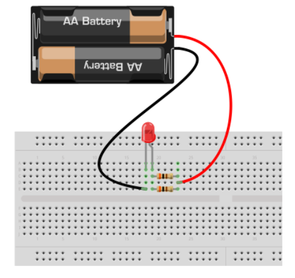

# Eletrônica Básica para Robótica

## Introdução

A eletrônica é a ciência que estuda o controle da energia elétrica por meios elétricos, utilizando circuitos formados por componentes elétricos e eletrônicos. Ela se divide em duas áreas principais:

- **Eletrônica Analógica**: Trabalha com sinais contínuos e variações suaves de tensão e corrente.
- **Eletrônica Digital**: Utiliza sinais discretos (0 e 1) para representar informações.

## Eletrônica na Robótica

Eletrônica + (Micro-Mecânica + Pneumática + Hidráulica) + Computação = Mecatrônica

Na **eletrônica** os seguintes símbolos são utilizados para representar unidades de medida (conforme Sistema Internacional):

- **V** = Volt (tensão)
- **W** = Watt (potência)
- **A** = Ampére (corrente)
- **C** = Coulomb (medida da carga elétrica)
- **Ω** = Ohm (resistência)
- **Hz** = Hertz (frequência)
- **F** = Farad (capacitância)
- **H** = Henry (indutância)
- **s** = Segundo (medida de tempo em segundos)

Os seguintes prefixos são utilizados para representar unidades (conforme Financiamento: Sistema Internacional):

- Pico (p): $`10^-12`$
- Nano (n): $`10^-9`$
- Micro (μ): $`10^-6`$
- Mili (m): $`10^-3`$
- Quilo (k): $`10^3`$
- Mega (M): $`10^6`$
- Giga (G): $`10^9`$

### Breve Histórico
- **1750**: Benjamin Franklin definiu o conceito de corrente elétrica.
- **1897**: Joseph Thomson descobriu o elétron.
- **1947**: Invenção do transistor por William Shockley.
- **1958**: Criação do primeiro circuito integrado.

## Corrente, Tensão e Potência

### Átomo

- Composto por **prótons, nêutrons e elétrons**.
- Os **prótons** carregam cargas positivas e estão presentes no núcleo do **átomo**.
- Os **nêutrons** não carregam carga e assim como os **prótons** estão presentes no núcleo do **átomo**.
- Os elétrons carregam carga negativa e orbitam o núcleo do **átomo**.
- **Observação**: Quanto mais próximo o **elétron** estiver do núcleo, maior será a força de atração sobre ele.

#### Características 
- Quando o **átomo** possui o mesmo número de **elétrons** e de **prótons** é considerado neutro.
- Quando o **átomo** possui um número maior de **prótons** do que de **elétrons** é considerado positivo.
- Quando o **átomo** possui um número maior de **elétrons** do que de **prótons** é considerado negativo.
- **Ionização** é o nome dado quando o **átomo** ganha ou perde **elétrons**.

### Conceitos Fundamentais

### Corrente 
- Os elétrons livres movimentam-se de um átomo a outro através de um meio condutor.
- Corrente elétrica é o fluxo de elétrons que circula em um condutor.
-  A corrente elétrica (símbolo **I**) é medida em Ampére (símbolo **A**).
- Para os elétrons se moverem de um **átomo** a outro é necessário haver uma diferença de potencial ou **tensão**.

### Tensão
- É a força responsável por impulsionar os **elétrons** em um **condutor**.
- A tensão é medida em **Volts (símbolo V).**
- Exemplos:
<ol>
  <li>Bateria/pilha de 9 volts</li>
  <li>Tomada de 110 ou 220 volts</li>
</ol>

 

### Potência 

- A **potência (medida em Watt (W))** é a grandeza que determina a **velocidade** em que a energia elétrica é transformada em outras formas de **energia** (trabalho).

- **Potência (P)**: A Unidade: Watt (W), (potência é igual a tensão multiplicado pela corrente). Calculada por $P = V * I$.

- Exemplos: 

| Chuveiro elétrico | Ferro de passar |
| ------------- | ------------- |
|  |   |
|   |   |

### Lei de Ohm
Relaciona tensão, corrente e resistência:
$ V = I * R $ onde:
- \( V \) = Tensão (V)
- \( I \) = Corrente (A)
- \( R \) = Resistência (Ω)

É possível calcular também:
- Resistência (R): $R=V/I$
- Corrente (I): $I=V/R$

### Tipos de Corrente
- **Corrente Contínua (CC)**: 
<ol>
    <li>Não altera o seu sentido, ou seja, ou é sempre positiva ou é sempre negativa. Fluxo unidirecional (ex: baterias).
</li>
    <li>Grande parte dos equipamentos eletrônicos trabalha com corrente contínua.
</li>
</ol>

- **Corrente Alternada (CA)**: 
<ol>
  <li>Fluxo bidirecional, alternando periodicamente (ex: rede elétrica).</li>
  <li>Na corrente alternada o sentido dos elétrons é invertido periodicamente, ou seja, ora é positiva ou é negativa.</li>
</ol>

- **Corrente Pulsante (PU)**: Somente alterna o valor. Corrente resultante da retificação da corrente
alternada.

 
 

## Resistores

### Função
- **Resistência** é uma grandeza que indica o quanto um determinado condutor se opõe a passagem de corrente elétrica.
- Limitam o fluxo de corrente em um circuito. Podem ser fixos ou variáveis (como potenciômetros).
- A resistência é medida em **Ohms** e o símbolo é a letra grega ômega **Ω**.

### Código de Cores
Resistores possuem faixas coloridas que indicam seu valor e tolerância:

| Cor     | Valor (1ª e 2ª faixa) | Multiplicador (3ª faixa) | Tolerância (4ª faixa) |
|---------|----------------------|-------------------------|----------------------|
| Preto   | 0                    | 1                       | -                    |
| Marrom  | 1                    | 10                      | 1%                   |
| Vermelho| 2                    | 100                     | 2%                   |
| Laranja | 3                    | 1.000                   | -                    |
| Amarelo | 4                    | 10.000                  | -                    |
| Verde   | 5                    | 100.000                 | -                    |
| Azul    | 6                    | 1.000.000               | -                    |
| Violeta | 7                    | 10.000.000              | -                    |
| Cinza   | 8                    | -                       | -                    |
| Branco  | 9                    | -                       | -                    |
| Ouro    | -                    | -                       | 5%                   |
| Prata   | -                    | -                       | 10%                  |

 
 

**Exemplo**: Um resistor com faixas laranja, laranja, marrom, ouro tem o valor:
- 3 (laranja), 3 (laranja) → 33
- 10 (marrom) → 33 × 10 = 330 Ω
- Tolerância: 5% (ouro)
- Resistência: 313.5 Ohm a 346.5 Ohm

### Tipos Especiais
- **LDR (Resistor Dependente de Luz)**: Resistência varia com a intensidade luminosa.
- **Potenciômetro**: Resistor variável ajustável manualmente.

### Associação de Resistores
- **Série**: Resistência total é a soma das resistências individuais $R_{eq} = R_1 + R_2 + \dots $.
- **Paralelo**: Para dois resistores: $ R_{eq} = \frac{R_1 \times R_2}{R_1 + R_2} $.

Realize o cálculo para o Circuito Paralelo em exemplo:

 
 

- Ligação de resistores em série

 
 

### [Visite o site da Tinkercad](https://www.tinkercad.com)

- Ligação de resistores em paralelo

 
 

 
 

- Ligação de um motor DC

 
 

 
 

- Ligação de um motor DC com resistência em série

 
 

 
 

- Ligação de um motor DC com controle de velocidade com potenciômetro

 
 

 
 

-Potenciômetro controlando a intensidade de luz emitida por um LED

 
 

- Potenciômetro controlando um LED e um motor DC

 
 

## Condutores, Isolantes e Semicondutores

### Condutores
Materiais com baixa resistência à passagem de corrente, como cobre e prata. Possuem muitos elétrons livres.

### Isolantes
Materiais com alta resistência, como borracha e vidro. Praticamente não permitem o fluxo de elétrons.

### Semicondutores
Materiais com propriedades intermediárias, como silício e germânio. São a base da eletrônica moderna.

#### Tipos
- **Intrínsecos**: Puros, sem impurezas.
- **Extrínsecos**: Dopados com impurezas para modificar suas propriedades.
  - **Tipo N**: Dopado com átomos pentavalentes (ex: fósforo), aumentando elétrons livres.
  - **Tipo P**: Dopado com átomos trivalentes (ex: boro), criando "lacunas" (ausência de elétrons).

## Diodos

### Função
Dispositivos que permitem a passagem de corrente em apenas um sentido (do ânodo para o cátodo).

### Tipos
- **Diodo Retificador**: Converte CA em CC.
- **LED (Diodo Emissor de Luz)**: Emite luz quando polarizado diretamente.
- **Diodo Zener**: Mantém uma tensão constante quando polarizado inversamente, usado em reguladores de tensão.

### Queda de Tensão
- Silício: ~0,7 V
- Germânio: ~0,3 V
- LED: Varia conforme a cor (ex: vermelho ≈ 1,8 V, azul ≈ 3,1 V).

## Capacitores

### Função
Armazenam energia elétrica em um campo eletrostático. Unidade: Farad (F).

### Tipos
- **Eletrolíticos**: Polarizados, alta capacitância (µF a mF).
- **Cerâmicos**: Não polarizados, baixa capacitância (pF a nF).

### Identificação
Capacitores cerâmicos usam códigos de 3 dígitos:
- Exemplo: "104" → 10 × 10⁴ pF = 100.000 pF = 0,1 µF.

## Transistores

### Função
Amplificam sinais ou funcionam como chaves eletrônicas.

### Tipos
- **Bipolares (BJT)**: NPN ou PNP, controlados por corrente.
- **FET**: Controlados por tensão, como MOSFETs.

### Terminais
- **BJT**: Base (B), Coletor (C), Emissor (E).
- **FET**: Porta (G), Dreno (D), Fonte (S).

### Parâmetros Importantes
- $ h_{FE} $: Ganho de corrente.
- $ V_{CE} $: Tensão coletor-emissor.

## Relês

### Função
Chaves eletromecânicas que controlam circuitos de alta potência com sinais de baixa potência.

### Tipos
- **Eletromecânicos**: Possuem contatos físicos.
- **De Estado Sólido (SSR)**: Sem partes móveis, maior durabilidade.

## Circuitos Integrados (CIs)

### Função
Circuitos miniaturizados que podem conter milhares de componentes em um único chip.

### Exemplos
- **Microcontroladores** (ex: ATMega328 no Arduino).
- **Reguladores de Tensão** (ex: 7805 para 5V).
- **Drivers de Motores** (ex: L298N para controle de motores DC).

## Eletrônica Digital

### Conceitos
- **Bit**: Unidade básica (0 ou 1).
- **Byte**: 8 bits.
- **Portas Lógicas**: Realizam operações booleanas (AND, OR, NOT, etc.).

### Portas Lógicas Básicas

| Porta   | Símbolo | Tabela Verdade           |
|---------|---------|--------------------------|
| AND     | &       | 0 & 0 = 0, 0 & 1 = 0, etc. |
| OR      | ≥1      | 0 OR 0 = 0, 0 OR 1 = 1, etc. |
| NOT     | 1       | NOT 0 = 1, NOT 1 = 0      |
| NAND    | &       | NAND é o inverso de AND   |
| NOR     | ≥1      | NOR é o inverso de OR     |

### CIs de Portas Lógicas
- 7408 (AND)
- 7432 (OR)
- 7404 (NOT)
- 7400 (NAND)

## Conclusão

Este material fornece uma base sólida para entender os princípios da eletrônica aplicada à robótica. Com esses conceitos, é possível projetar e construir circuitos para controlar motores, sensores e outros dispositivos essenciais em projetos robóticos. Pratique montando circuitos simples no protoboard e explore as possibilidades criativas que a eletrônica oferece!
   