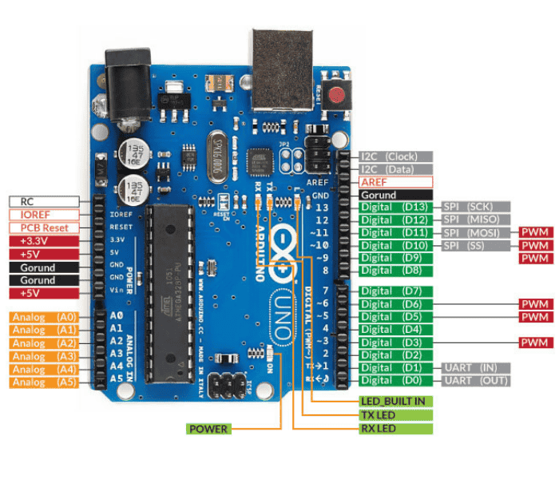
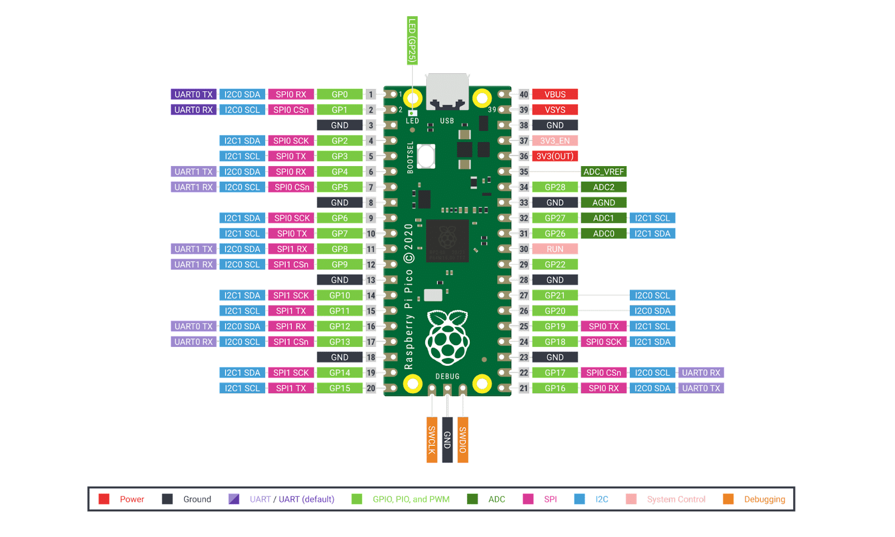

# **Microcontroladores**  

A **eletrônica básica** nos ensinou sobre componentes como resistores, capacitores, transistores e circuitos integrados, que são a base para construir sistemas eletrônicos. Agora, vamos avançar para os **microcontroladores**, que são como "cérebros" que controlam esses componentes, permitindo criar projetos de robótica, automação e IoT (Internet das Coisas).  

---

## **O que é um Microcontrolador?**  
Um **microcontrolador** é um pequeno computador em um único chip, contendo:  
✅ **CPU** (Unidade Central de Processamento) – para executar programas.  
✅ **Memória** (RAM e Flash) – para armazenar dados e código.  
✅ **Portas de I/O** (Entrada/Saída) – para conectar sensores, motores e LEDs.  
✅ **Periféricos** (ADC, PWM, UART, SPI, I²C) – para comunicação e controle.  

### **Para que servem? Onde são usados?**  
Microcontroladores estão em **quase tudo** hoje em dia:  
- **Robótica** (controlar motores, sensores).  
- **Automação Residencial** (luzes, fechaduras inteligentes).  
- **Eletrônica Embarcada** (carros, drones, máquinas industriais).  
- **IoT** (dispositivos conectados à internet, como sensores de temperatura).  

---

## **Tipos de Microcontroladores**  

| **Tipo**       | **Exemplos**          | **Características**                          |
|---------------|----------------------|--------------------------------------------|
| **8-bit**     | ATmega328 (Arduino)  | Simples, baixo custo, ideal para projetos básicos. |
| **16-bit**    | MSP430 (Texas Inst.) | Mais eficiente em energia, usado em wearables. |
| **32-bit**    | ESP32, STM32         | Mais potentes, com Wi-Fi/Bluetooth, usados em IoT. |
| **ARM Cortex**| Raspberry Pi Pico    | Alta performance, usado em automação avançada. |

---

## **Principais Plataformas de Microcontroladores**  

### **1. Arduino (ATmega328 / ATmega2560)**  
- **Usos**: Prototipagem rápida, robótica educacional.  
- **Especificações**:  
  - **Clock**: 16 MHz (Uno) / 16 MHz (Mega).  
  - **Memória**: 32KB Flash, 2KB RAM (Uno).  
  - **Portas**: ~20 I/O digitais, 6 PWM, 6 ADC.  
  - **Comunicação**: UART, SPI, I²C.  
  - **Vantagem**: Facilidade de uso, grande comunidade.  

### **2. BBC micro:bit (nRF51822)**  
- **Usos**: Educação, projetos simples com sensores integrados.  
- **Especificações**:  
  - **Clock**: 16 MHz.  
  - **Memória**: 256KB Flash, 16KB RAM.  
  - **Portas**: 25 I/O, 3 ADC, Bluetooth.  
  - **Extras**: Matriz de LEDs, acelerômetro, bússola.  
  - **Vantagem**: Ideal para crianças e iniciantes. 

### **3. ESP32 (Xtensa LX6 / RISC-V)**  
- **Usos**: IoT, Wi-Fi/Bluetooth, automação.  
- **Especificações**:  
  - **Clock**: 160 MHz (dual-core).  
  - **Memória**: 4MB Flash, 520KB RAM.  
  - **Portas**: 34 GPIO, 18 ADC, 10 PWM.  
  - **Comunicação**: Wi-Fi, Bluetooth, SPI, I²C.  
  - **Vantagem**: Custo-benefício para projetos conectados.  

### **4. Raspberry Pi Pico W (RP2040)**  
- **Usos**: Automação, robótica, projetos avançados.  
- **Especificações**:  
  - **Clock**: 133 MHz (dual-core ARM Cortex-M0+).  
  - **Memória**: 2MB Flash, 264KB RAM.  
  - **Portas**: 26 GPIO, 3 ADC, 16 PWM.  
  - **Comunicação**: Wi-Fi, UART, SPI, I²C.  
  - **Vantagem**: Alto desempenho por baixo custo.  

---

## **Qual Escolher?**  

| **Plataforma** | **Melhor Para** | **Dificuldade** |  
|--------------|----------------|----------------|  
| **Arduino**  | Iniciantes, robótica básica. | Fácil |  
| **micro:bit** | Educação, projetos simples. | Muito fácil |  
| **ESP32**    | IoT, Wi-Fi/Bluetooth. | Intermediário |  
| **RPi Pico W**| Projetos avançados, automação. | Intermediário/Avançado |  

---

## **Conclusão**  
Os microcontroladores são a **ponte entre a eletrônica básica e a robótica**, permitindo que circuitos simples ganhem "inteligência". Plataformas como **Arduino, micro:bit, ESP32 e Raspberry Pi Pico** oferecem diferentes níveis de complexidade, atendendo desde projetos escolares até sistemas industriais.  

**Próximo passo:** Aprender a programar microcontroladores e conectar sensores e atuadores! 🚀  

🔌 **Dica:** Se você já domina resistores, LEDs e motores, agora é hora de programar um Arduino para controlá-los!