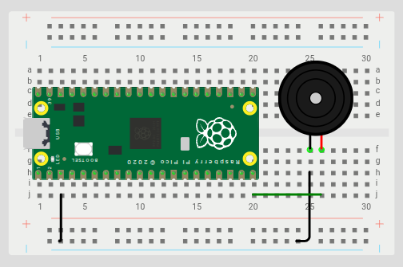
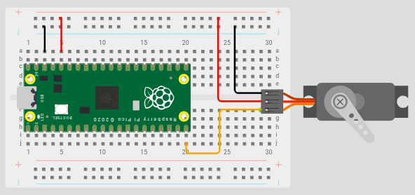

# Raspberry Pi Pico W — Introdução e Exemplos com MicroPython

## 📌 Sobre o Raspberry Pi Pico W

O **Raspberry Pi Pico W** é um microcontrolador de baixo custo desenvolvido pela Raspberry Pi Foundation, baseado no chip **RP2040** (dual-core ARM Cortex-M0+ a até 133 MHz). A versão **W** adiciona conectividade **Wi-Fi 2.4 GHz** (via chip Infineon CYW43439), tornando-o ideal para projetos de IoT e automação.

### Especificações Principais

| Característica        | Detalhe                              |
|-----------------------|--------------------------------------|
| Microcontrolador      | RP2040 (dual-core ARM Cortex-M0+)    |
| Clock                 | Até 133 MHz                          |
| Memória Flash         | 2 MB                                 |
| RAM                   | 264 KB SRAM                          |
| Pinos GPIO            | 26 pinos multifuncionais             |
| Conectividade         | Wi-Fi 2.4 GHz (802.11n)              |
| Protocolos            | UART, SPI, I2C, PWM, ADC            |
| Alimentação           | 1.8V – 5.5V                          |
| Linguagem suportada   | MicroPython, C/C++                   |

### Por que usar o Raspberry Pi Pico W?

- **Custo acessível** — uma das opções mais baratas com Wi-Fi integrado.
- **Fácil de programar** — suporte oficial ao MicroPython e ao SDK em C/C++.
- **Comunidade ativa** — ampla documentação e bibliotecas disponíveis.
- **Versátil** — adequado para projetos que vão desde automação residencial até prototipagem de produtos conectados.

---

## 🛠️ Configuração do Ambiente

1. Baixe o firmware MicroPython para o Pico W em: https://micropython.org/download/RPI_PICO_W/
2. Instale o firmware segurando o botão **BOOTSEL** ao conectar o cabo USB.
3. Utilize o **Thonny IDE** ou o **VS Code com extensão MicroPico** para programar.
4. Instale a biblioteca `picozero` via Thonny (`Ferramentas > Gerenciar pacotes`).

---

## 📦 Biblioteca Utilizada

Os exemplos abaixo utilizam a biblioteca **`picozero`**, que simplifica o controle de componentes eletrônicos no Raspberry Pi Pico. Ela oferece classes de alto nível como `Speaker`, `Servo`, `LED`, entre outras.

---

## 💡 Exemplos de Projetos

---

### Exemplo 1 — Buzzer Passivo (Alarme Sonoro)

**Objetivo:** Testar um buzzer passivo para reproduzir um som de alarme em intervalos de um segundo.

#### Conexões do Hardware

| Componente     | Pino do Componente | Pino do Pico W |
|----------------|--------------------|----------------|
| Buzzer Passivo | GND                | GND            |
| Buzzer Passivo | + (Sinal)          | GPIO 15        |

#### Diagrama do Circuito


> 

#### Código

```python
# Objetivo do projeto: Testar um buzzer passivo para reproduzir um som de alarme em intervalo de um segundo
#
# Hardware e conexões utilizadas:
#   GND do buzzer passivo conectado ao GND do Raspberry Pi Pico
#   Pino + do buzzer passivo conectado ao Pino GPIO 15
#
# Programador: Felipe Gonçalves 

# se um buzzer passivo for utilizado, importe a classe Speaker do picozero
from picozero import Speaker
from time import sleep

# criando um objeto Speaker
speaker = Speaker(15)

# apita continuamente em intervalo de 1 segundo enquanto a placa estiver ligada
# obs: um buzzer passivo também pode ser usado para reproduzir diferentes tons
while True:
    speaker.on()
    sleep(1)
    speaker.off()
    sleep(1)
```

---

### Exemplo 2 — Servo Motor (Movimentação de Braço)

**Objetivo:** Mover o braço do servo pelas posições mínima, central e máxima.

#### Conexões do Hardware

| Componente   | Pino do Componente | Pino do Pico W |
|--------------|--------------------|----------------|
| Servo Motor  | GND (Fio Marrom)   | GND            |
| Servo Motor  | V+ (Fio Vermelho)  | 3.3V           |
| Servo Motor  | PWM (Fio Laranja)  | GPIO 15        |

#### Diagrama do Circuito


> 

#### Código

```python
# Objetivo do projeto: Mover o braço do servo das posições mínima, central e máxima
#
# Hardware e conexões utilizadas:
#   GND do servo conectado ao GND do Raspberry Pi Pico
#   V+ do servo conectado ao 3.3 V do Raspberry Pi Pico
#   Pino PWM do servo conectado ao Pino GPIO 15
# 
# Programador: Felipe Gonçalves 

# módulos
from picozero import Servo  # importando a classe Servo para controlar facilmente o motor servo
from time import sleep

# criando um objeto Servo
servo = Servo(15)

# move continuamente o braço do servo para as posições mínima, central e máxima (por 1 segundo cada)
while True:
    # movendo o braço do servo para a posição mínima
    servo.min()
    sleep(1)

    # movendo o braço do servo para a posição central
    servo.mid()
    sleep(1)

    # movendo o braço do servo para a posição máxima
    servo.max()
    sleep(1)
```

---

## 📚 Referências

- [Documentação oficial do Raspberry Pi Pico W](https://www.raspberrypi.com/documentation/microcontrollers/raspberry-pi-pico.html)
- [Documentação da biblioteca picozero](https://picozero.readthedocs.io/)
- [MicroPython para o Pico W](https://micropython.org/download/RPI_PICO_W/)
- [Thonny IDE](https://thonny.org/)

---

*Desenvolvido por Felipe Gonçalves*
